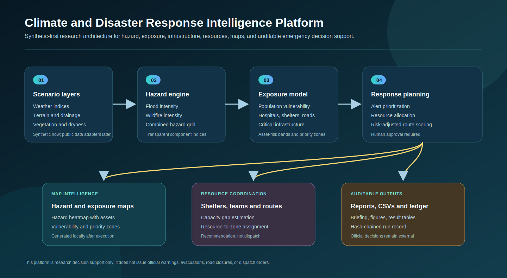
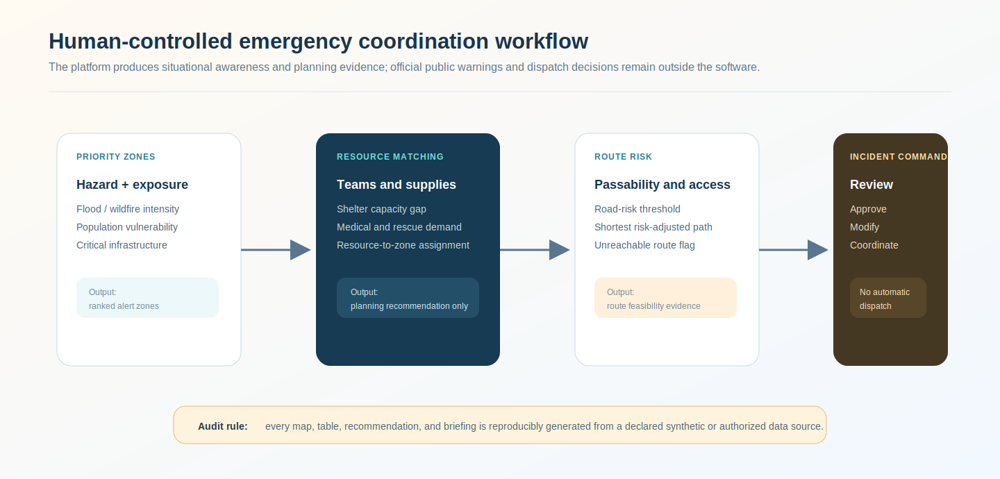
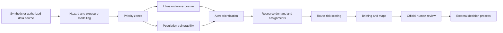

# Climate and Disaster Response Intelligence Platform

<p align="center"><strong>Synthetic-first research platform for hazard modelling, infrastructure exposure, population vulnerability, resource planning, route-risk scoring, maps, briefings, and auditable emergency decision support.</strong></p>

<p align="center">
  <a href="../../actions/workflows/python-checks.yml"></a>
  <a href="LICENSE"></a>
  
  
</p>

> **Emergency-response boundary:** this independent academic prototype is research decision-support only. It does not issue official public warnings, evacuation orders, road closures, dispatch orders, shelter-opening decisions, or live weather/satellite claims. All outputs require official human review before any real-world action.

---

## Research objective

Can a transparent climate-disaster intelligence platform combine hazard simulation, infrastructure exposure, population vulnerability, and resource planning to prioritize emergency-response actions while preserving auditability and human decision control?

| Research question | Evidence generated by a local run |
| --- | --- |
| Where are the highest-risk synthetic hazard zones? | Hazard map, vulnerability map, priority-zone table |
| Which infrastructure assets are most exposed? | Asset exposure bands and criticality-ranked table |
| Which population zones require planning attention? | Exposed population and vulnerable-population summary |
| How should limited resources be staged? | Resource allocation table and route-risk scores |
| Can response evidence be reviewed and reproduced? | Local briefing, CSV outputs, figures, and audit ledger |

---

## Architecture

<p align="center"></p>

The image is a conceptual documentation diagram. It is not an official map, satellite product, forecast, or emergency-management system.

| Layer | Function | Output |
| --- | --- | --- |
| Scenario layers | Synthetic weather, terrain, drainage, vegetation, population | Gridded fictional region |
| Hazard engine | Flood, wildfire, and combined hazard intensity | Hazard-intensity raster table |
| Exposure model | Population vulnerability and infrastructure criticality | Asset exposure and priority zones |
| Alert engine | Severity, confidence, exposure, and asset importance | Ranked response alerts |
| Planning engine | Resource demand, assignments, and route risk | Planning tables and maps |
| Audit layer | Seed, config, summaries, and hash chain | Reproducible local evidence |

---

## Run today — no dataset needed

The project runs immediately with fictional synthetic data:

```bash
python scripts/run_synthetic_disaster_lab.py
```

Windows quick start:

```bat
cd %USERPROFILE%\disaster-response-intelligence-platform
git pull

py -m venv .venv
.venv\Scripts\activate

python -m pip install --upgrade pip
python -m pip install -r requirements.txt
python scripts/run_synthetic_disaster_lab.py
```

Run separate hazard scenarios:

```bash
python scripts/run_synthetic_disaster_lab.py --scenario flood --grid-size 36 --seed 42
python scripts/run_synthetic_disaster_lab.py --scenario wildfire --grid-size 36 --seed 42
python scripts/run_synthetic_disaster_lab.py --scenario combined --grid-size 36 --seed 42
```

---

## Generated local outputs

```text
outputs/results/synthetic_grid_hazard.csv
outputs/results/synthetic_infrastructure_assets.csv
outputs/results/synthetic_asset_exposure.csv
outputs/results/synthetic_priority_zones.csv
outputs/results/synthetic_alerts.csv
outputs/results/synthetic_response_resources.csv
outputs/results/synthetic_resource_demand.csv
outputs/results/synthetic_resource_assignments.csv
outputs/results/synthetic_route_risk.csv
outputs/results/synthetic_road_links.csv
outputs/results/synthetic_weather_series.csv
outputs/results/synthetic_disaster_summary.json
outputs/results/audit_ledger.jsonl
outputs/reports/synthetic_disaster_brief.md

outputs/figures/synthetic_hazard_infrastructure_map.png
outputs/figures/synthetic_vulnerability_priority_map.png
outputs/figures/synthetic_resource_allocation_map.png
outputs/figures/synthetic_alert_priority.png
outputs/figures/synthetic_weather_indices.png
```

Every generated file is labeled `synthetic`. These artifacts demonstrate the research workflow and reproducibility; they are not real disaster intelligence.

---

## Human-controlled response workflow

<p align="center"></p>



The software ends at evidence production. Official emergency-management decisions remain external.

---

## Hazard model

The synthetic platform builds interpretable component indices:

| Component | Synthetic role |
| --- | --- |
| Rainfall index | Flood forcing |
| River-level index | Flood proximity pressure |
| Drainage index | Local drainage stress |
| Elevation proxy | Low-lying exposure indicator |
| Temperature index | Wildfire heat pressure |
| Wind index | Fire spread pressure |
| Dryness index | Fuel and soil dryness proxy |
| Vegetation index | Fuel-load proxy |

Flood intensity is a weighted combination of rainfall, river-level pressure, drainage stress, and elevation. Wildfire intensity is a weighted combination of temperature, wind, dryness, and vegetation. Combined scenarios use the stronger hazard signal per grid cell.

These equations are **research heuristics**, not hydrological, hydraulic, meteorological, or fire-spread models.

---

## Exposure, infrastructure, and alert scoring

### Infrastructure assets

The synthetic region includes hospitals, shelters, power stations, schools, bridges, water pumps, and fire stations. Each asset receives an exposure score from local hazard, local vulnerability, and asset criticality.

### Priority zones

Zones are ranked by hazard intensity, vulnerability score, and population exposure. Alerts are produced with:

```text
priority = hazard + vulnerability + population + critical infrastructure + confidence
```

| Alert field | Meaning |
| --- | --- |
| `severity` | Watch, moderate, high, or critical band from score |
| `priority_score` | Transparent ranking score in the synthetic scenario |
| `recommended_focus` | Human-readable planning focus, not an order |
| `top_asset_type` | Highest exposed local infrastructure type |
| `confidence` | Scenario confidence parameter, not official certainty |

---

## Resource planning and route-risk scoring

| Module | What it does | Boundary |
| --- | --- | --- |
| Resource demand | Estimates fictional need for rescue, medical, fire, evacuation, pump, and supply resources | Planning approximation only |
| Resource allocation | Assigns resource pools to high-priority zones using fit, distance, mobility, and hazard type | Not a dispatch order |
| Shelter analysis | Compares exposed population to lower-risk shelter capacity | Not an official shelter plan |
| Route risk | Uses passable synthetic road graph and hazard-weighted cost | Not navigation or road-closure guidance |

Route scores are useful for demonstrating graph-based coordination logic but must never be used for real navigation.

---

## MATLAB workflow

After running the Python lab:

```matlab
addpath('matlab')
plot_disaster_timeseries('outputs')
```

The MATLAB script reads `outputs/results/synthetic_weather_series.csv` and generates a separate figure of hazard-driving synthetic weather indices.

---

## Repository map

```text
.
├── assets/                         Conceptual architecture and workflow diagrams
├── configs/                        Reproducible synthetic-lab configuration
├── data/                           Data boundary and future adapter guidance
├── docs/                           Methodology, synthetic lab, response policy, report template
├── matlab/                         Local signal/time-series analysis scripts
├── notebooks/                      Synthetic disaster lab walkthrough
├── outputs/                        Local-only figures, maps, results, reports, ledger
├── scripts/                        One-command synthetic lab runner
├── src/disasterintel/
│   ├── synthetic.py                Fictional hazard, infrastructure, resources, roads
│   ├── exposure.py                 Population and asset exposure scoring
│   ├── alerts.py                   Emergency alert prioritization
│   ├── resources.py                Demand, shelter, and resource-allocation heuristics
│   ├── routes.py                   Risk-adjusted road graph planning
│   ├── visualization.py            Maps and figures from executed runs
│   ├── reporting.py                Local markdown briefing generator
│   ├── ledger.py                   Hash-chained audit ledger
│   └── config.py                   Seeds and local-output folders
└── tests/                          Data-free unit and pipeline tests
```

---

## Documentation

- [`docs/methodology.md`](docs/methodology.md): modelling assumptions, scoring logic, route-risk, auditability, limitations.
- [`docs/synthetic_lab.md`](docs/synthetic_lab.md): runnable demo command, generated files, interpretation rules.
- [`docs/response_policy.md`](docs/response_policy.md): human-control boundary and prohibited software actions.
- [`docs/report_template.md`](docs/report_template.md): evidence-only report skeleton.
- [`data/README.md`](data/README.md): future data-adapter requirements and raw-data boundary.

---

## Reproducibility

- Fixed seed controls the entire synthetic region.
- Generated CSVs, maps, and briefings are local and ignored by Git.
- A hash-chained audit ledger records each run.
- Unit tests cover synthetic generation, exposure scoring, alerts, resource allocation, routes, and ledger integrity.
- GitHub Actions runs data-free checks.

Run tests locally:

```bash
python -m pytest
```

---

## Future public-data adapters

The synthetic-first system can later be extended with authorized or public sources for weather, flood alerts, satellite fire products, open infrastructure records, population grids, road networks, and resource inventories. Those adapters must document source, license, timestamp, uncertainty, and operational boundary. Raw data should stay under `data/raw/` and out of Git unless explicitly permitted.

---

## Limitations

1. Synthetic hazard layers are fictional and not physically calibrated.
2. Infrastructure and population records are simulated.
3. Resource allocation is a heuristic and cannot replace official incident command.
4. Route risk is synthetic and not real navigation guidance.
5. Figures are research maps, not official geospatial products.
6. No public warning, evacuation, shelter, road closure, or dispatch action is issued by the software.

## License

Released under the [MIT License](LICENSE). Real disaster, satellite, infrastructure, and response data are not included.
